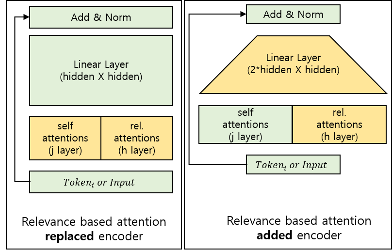

# BERT For IR 

## IDEA

Bert learns linguistic semantic information based on Masked Language Model and Sentence Prediction Task.  
Also by using multi-head self-attention, enlarges the mutual information between words  
In IR, semantic information between words is important, but we also need to consider the relevance between words.  

### Capture relevance between words

Relevance between words changes as times goes by.  
For example, word “Manchester arena” and “suicide bomb” might not relevant before the crime happened in “Manchester Arena bombing”.  
But after the crime, the word “Manchester” and “suicide bomb” need to be related.  
Based on the user click-logs, we can detect these relevant relationship words and give attention to them.  

### Self Attention Head

Bert’s self attention head gets attention score between all the input words from target words.  
Unlike original transformer, it uses same Q,K,V.  
Based on the similarity between tokens, it calculates the attention score between words  
If words inside of the input sequence have semantically similar meaning or position between them are close(if the input embedding of two have high similarity score), these words will have higher attention score.

### Relevance Attention Head

However, if two words do not have similar input embeddings, these words can not get attention.  
We want to have attention on high relevant words so that we can used that in IR task, so we need to define new attention head beside self-attention-head.  
So, how to define ‘high relevant words’  
We will define words from ‘query’ and words from ‘clicked documents’ have high relevance.  
Relevance Attention Head is the concept that give attention to the relevant words. As, we previously define words from ‘query’ and words from ‘clicked documents’ have high relevance.  
So we will make another attention head that calculates the attention only between tokens from query and tokens from clicked documents. By doing that, attention will be given to the document words rather then less relevant words inside query.   
Also for calculating attention score, we will add tf-idf score of each token inside of the documents as a parameter that is multiplied to final score. So that attention can be focused on the important words.  

### General Architecture

Self-attention itself is also valuable as the relationship between words inside query and document are important.  
As Bert model uses multiple attention heads, we can allocate some of these heads to relevance attention head.  
So the general architecture are same, but we will add/replace relevant attention head to the attention layer parts inside of the model.  

## Tranining Task

### Bert trains its own model based on two different tasks.
* Masked Language Model
* Next Sentence Prediction Task 

### Our Model
* Currently, we will use pre-trained model and do the fine-tuning based on pre-trained model
* Masked Language Model will be used under same rule.
* Next Sentence Prediction Task will be converted to Click Prediction tasks. 
## Evaluation Tasks

### BERT Retrieval Model (vs pre-trained BERT)
  * BERT CLS token will give probability whether document is clicked or not at last layer
  * Based on probability, we can rank documents  

## Data settings

In side of the data dir used for training step, there should be 3 different files.
train.tsv / doc.pkl / tfidf.pkl

### train.tsv

It should be tap separated file with header (query \t doc_id \t click)

Exmaple: 
query \t doc_id \t click  
Manchester Bombing \t doc_12334 \t 1   
Manchester Bombing \t doc_12578 \t 0   
...

### doc.pkl

doc.pkl files is a pickle file that contain the dictionary of document.  
We merge the title and the body of the news article. 
 
Example:
{"doc_1234": "manchester arena bomb ~~~ ", "doc_12578": "samsung release new phone ~~~", ... }

### tfidf.pkl

tfidf.pkl is  a pickle file that contain the dictionary of tfidf weights of each words in the documents.

Example:

{"doc_1234": {"manchester":0.544, "arena":0.433 "bomb":0.12, ~~~ }, "doc_12578": {"samsung": 0.22, "release": 0.33, "new":0.22, ... } ..}

